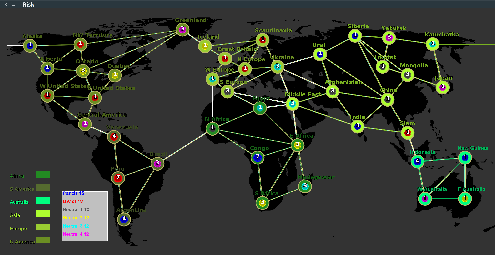

# Risk
	

Java-based implementation of the popular board game [Risk](https://en.wikipedia.org/wiki/Risk_(game)).

*Features:*

* dynamic GUI
* text-based input
* real-time gameplay log
* 2 human players and 4 neutral players.